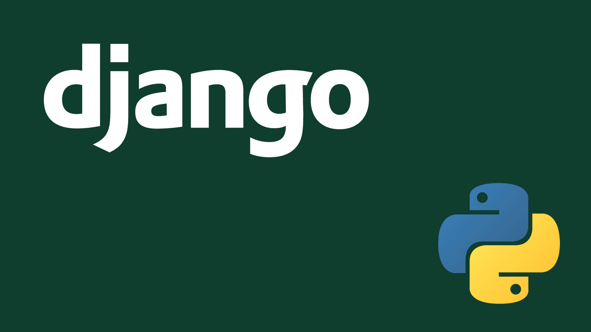

# Car Pooling Web Site

This repository contains the code of a Car Pooling Web Site made with <b>Django</b>. <br>

<div style="display:flex;">
	
	
</div>

<br>

## Dependencies

//TODO

## How try it

```bash

pipenv --rm
pipenv install  #Scaricare la versione di Python presente nel file "Pipfile"
pipenv shell
cd <PROJECT_NAME> 
python3 manage.py runserver

```

## Main functionality

1. User registration/login.
2. Search:
	* Destination location.
	* Departure location.
	* Specific user.
3. User vehicle registration (Model, Year, License Plate, Photo).
4. Carpooling reservation management.
5. Driver rating system.
6. User profile with travel history and owned vehicles.
7. Recommendation system based on popular destinations.
8. Section with ranking of best drivers (Kilometers traveled, reviews, etc.).

## How is made a Django Project?

📁Liv.1

- <b>Pipfile</b> : This file is used to specify the packages and dependencies required for a Python project. 
  
- <b>Pipfile.lock </b>: This file is automatically generated when you install packages from a Pipfile using the `pipenv install` utility. It ensures that the installed versions of those packages are the same across all environments.
  
- <b>Application name</b> : Directory containing the full project.

📁📁Liv.2

